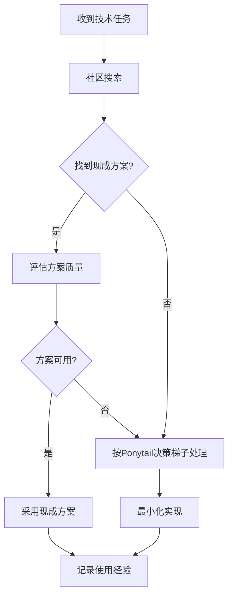

# Community-First Research — 社区优先研究准则

## 核心原则

**每次安装、添加代码、配置工具前，必须先在Hermes几大社区或论坛搜索查找有没有现成的更好的更优的可以借鉴的。**

这不是建议，是铁律。违反=浪费时间+重复造轮子。

## 搜索优先级顺序

### 1. Hermes官方社区 (最高优先级)
- **Hermes Discord**: `#help` `#skills` `#plugins` 频道
- **Hermes GitHub**: issues, discussions, 已有技能仓库
- **Hermes官方文档**: hermes-agent.nousresearch.com/docs

### 2. AI/Agent生态社区
- **Cocoloop Hub**: AI技能市场
- **Anthropic Discord**: Claude相关讨论
- **OpenAI Forum**: GPT相关最佳实践
- **Hugging Face**: 模型和工具集成

### 3. 技术论坛
- **Stack Overflow**: 通用技术问题
- **Reddit**: r/hermes, r/LocalLLM, r/MachineLearning
- **V2EX**: 技术讨论区

## 搜索关键词模板

### 安装类任务
```
site:github.com "hermes skill" + [工具名] + "best practice"
site:discord.com "hermes" + [工具名] + "setup"
hermes skills install [工具名]
```

### 代码编写任务
```
site:github.com "hermes" + [功能需求] + "implementation"
site:stackoverflow.com "hermes" + [技术问题] + "solution"
hermes agent [功能需求]
```

### 配置类任务
```
site:hermes-agent.nousresearch.com/docs [配置项] + "example"
site:github.com "hermes config" + [配置项] + "yaml"
```

## 现成方案识别标准

### ✅ 优先采用现成方案的条件
1. **Star数 > 100** - 社区验证过
2. **最近更新 < 6个月** - 维护活跃
3. **有完整文档** - 使用门槛低
4. **issue解决率高** - 维护者响应积极
5. **有成功案例** - 有人实际用过

### ❌ 避免使用的信号
1. **Star数 < 50** - 可能没人用
2. **超过1年未更新** - 可能已废弃
3. **文档缺失或过时** - 使用困难
4. **大量open issues** - 维护不及时
5. **依赖过时** - 可能不兼容当前环境

## Ponytail决策梯子集成

写代码前，结合Ponytail哲学：

```
1. 这东西真的需要存在吗？(YAGNI)
   → 先搜索是否有现成解决方案
   
2. 标准库已经做了？用标准库
   → 搜索Hermes内置工具和技能
   
3. 平台/系统原生功能覆盖？用原生的
   → 搜索操作系统原生方案
   
4. 已装的依赖能解决？用现成的
   → 搜索已安装工具的插件/扩展
   
5. 能写成一行？写成一行
   → 搜索简洁的最佳实践
   
6. 写完才：最小能 work 的代码
   → 搜索最小可行实现
```

## Pitfalls

### PITFALL: Stating platform exclusivity without verification
**现象**: 找到某个软件的 Windows 版页面，立即断言"没有 Mac 版"或"只有 Windows 版"。后续被用户当场纠正。

**诊断**: 用户纠正=你的研究方法有缺陷，不是用户多疑。

**正确做法**: 工具研究时，平台可用性必须通过独立搜索确认：
```bash
# 错误做法
→ 找到某工具的 Windows 下载页 → 结论："这是 Windows 软件"  ❌
→ 搜不到 Mac 版 → 结论："没有 Mac 版"  ❌

# 正确做法  
→ 找到 Windows 版页面后 → 主动搜 "[工具名] Mac版" 或 "[工具名] cross-platform"
→ 搜不到 ≠ 确认无，可能是搜索覆盖不足
→ 官方没有明确声明跨平台支持之前，默认存疑，结论措辞用"目前未找到 Mac 版"而非"没有 Mac 版"
→ 如果核心场景是跨平台，必须明确验证每个目标平台
```

**本次教训**: AutoTiny 研究时，搜到 autotiny.cn 的 Windows 下载页就下结论「没有 Mac 版」。用户立刻纠正「不是没有 Mac 版吗」——这是草率结论的明确信号，重搜后发现确认无 Mac 版，但下结论的方式本身是错的。记住：**被用户当场纠正=研究深度不足**，下次遇到同类结论主动加一道二次验证再开口。
**本次教训**: AutoTiny 研究时，我搜到 autotiny.cn 的 Windows 下载页就下结论，用户纠正后重搜确认无 Mac 版，但下结论的方式本身是错的。

---

### Failure 66: 重复造轮子 (2026-07-05)
**现象**: 用户强调"重新安装skill和需要添加代码一定要先在hermes几大社区或论坛搜索查找有没有现成的更好的更优的可以借鉴的"
**根因**: 没有建立社区搜索习惯，直接动手写代码/安装
**修法**: 建立社区-first工作流，任何技术任务前强制搜索

## 工作流程



## 关联技能
- `ponytail-decision-ladder` — 代码编写决策流程
- `hermes-skill-discovery` — Hermes技能发现
- `proactive-execution` — 立即执行，但先搜索

## 历史变更
- v1.0.0 (2026-07-05): 初始版本，基于用户强调的社区优先原则